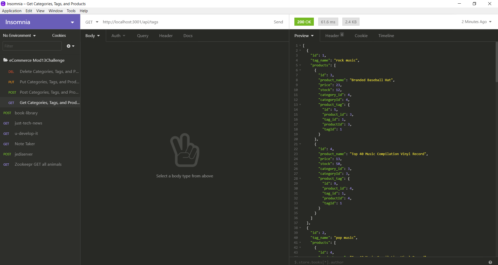

# mod13challenge
The back-end for an e-commerce site.

## Description: 
This application is the back-end for an eCommerce website. Although there is no front-end, it can be demonstrated with Insomnia Core. It focuses on products, and the tags and categories for those products.

## Screenshot of Generated Webpage

## About the Project:
The back-end relies on the use of Sequelize to create the necessary tables for the app. Categories, tags, product tags, and the products are all defined using models, and are associated with each other for 1-1 and 1-Many associations. The routes created use the Sequelize findAll, update, create, and destroy methods to achieve standard CRUD actions.

## Video Walkthrough:
Don't forget to checkout the video walkthrough [HERE!](https://github.com/adamkeyser45/mod13challenge/blob/master/assets/Mod13Challenge%20Video%20Walkthrough.webm)
